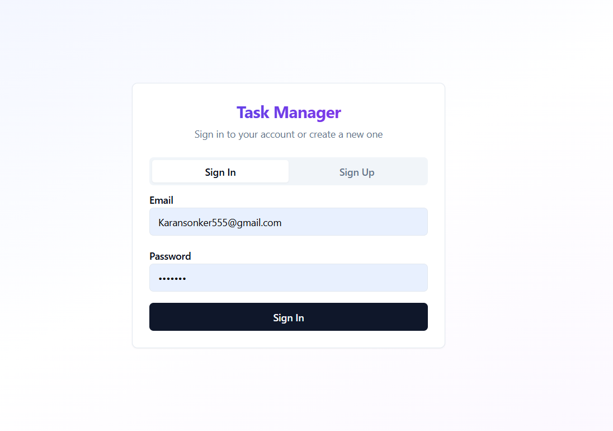
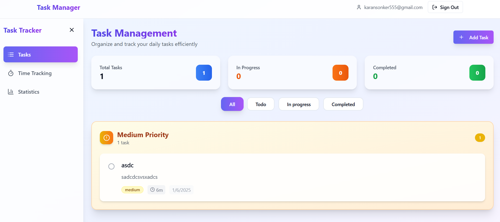

Task Manager

A full-stack productivity web app built to manage daily tasks, track time spent, and visualize productivity stats. Built using React (TypeScript) for the frontend and Node.js + Express + PostgreSQL for the backend.

🚀 Features
✅ Authentication
Secure JWT-based login and registration system.

Form validations and error handling.

Example:
 

📝 Task Management
Create, read, update, and delete tasks.

Assign priorities and due dates.

Filter tasks by status or date.

⏱️ Time Tracking
Start/Stop timer for individual tasks.

Track total time spent per task and session.

View historical tracking logs.

📊 Productivity Dashboard
Visualize daily, weekly, and monthly productivity.

Charts and summary stats for completed tasks and time usage.

⚙️ Tech Stack
Frontend: React, TypeScript, Tailwind CSS

Backend: Node.js, Express.js, PostgreSQL

Authentication: JWT (JSON Web Token)

ORM: Prisma

Other Tools: bcrypt, cors, dotenv, zod, etc.

📂 Folder Structure
graphql
Copy
Edit
client/       # React frontend
server/       # Node.js backend
 └── prisma/  # PostgreSQL schema and migrations
screenshots/  # UI snapshots
📸 Screenshots
Login/Register Page:
 

Task Overview Page:
 

🛠️ How to Run Locally
bash
Copy
Edit
# Clone the repo
git clone https://github.com/karanSonker/Task_schedular.git

Deployed link : https://task-schedular-zeta.vercel.app/

# Setup backend
cd server
npm install
npx prisma migrate dev
npm start

# Setup frontend
cd ../client
npm install
npm run dev
🙋‍♂️ Author
Karan Sonker

